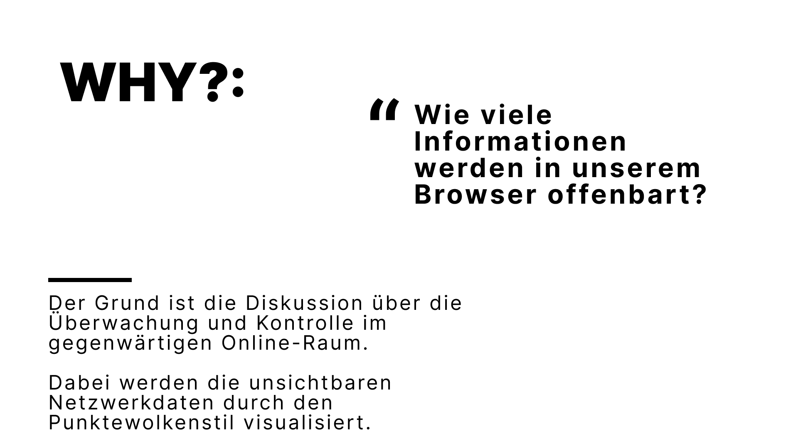
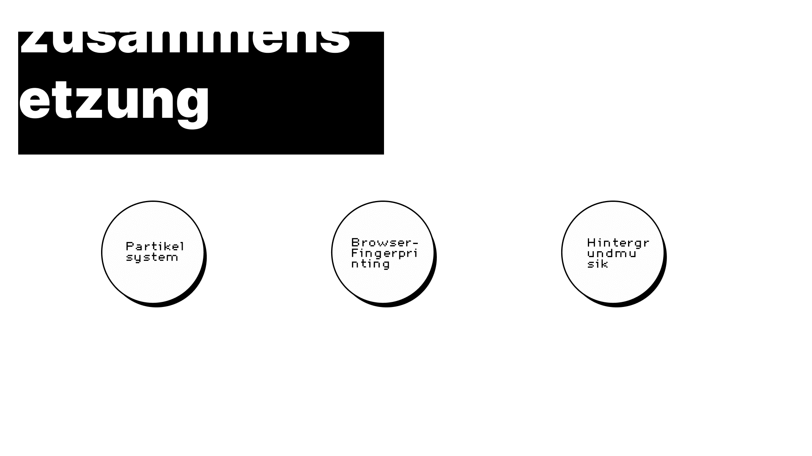

# [Data-shadow](https://datashadow.vercel.app/)

## Brief
An interactive VR installation in the style of a point cloud that shows the invisible traces of online surveillance and the personal data flow in online space

