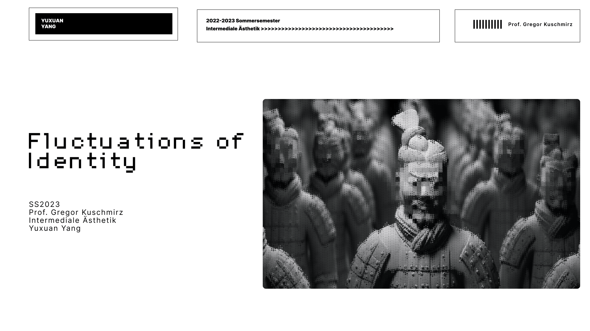
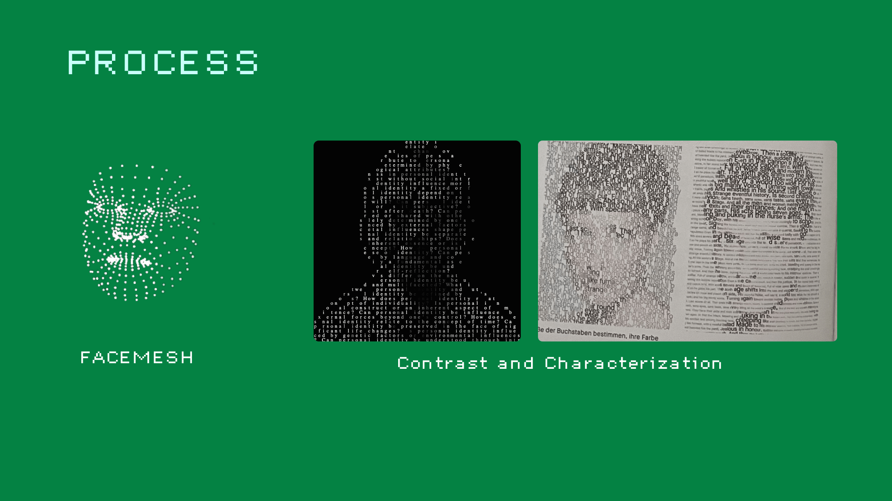
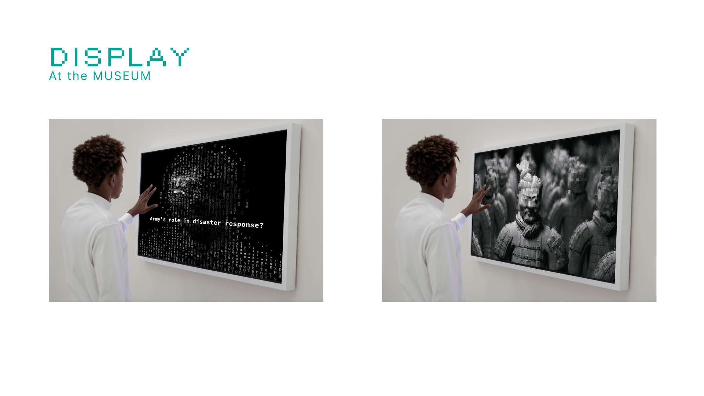

# [LINK](https://typoface.vercel.app/)

## Concept
Fluctuations of Identity is a digital media art project that combines webcam-based face recognition technology with the iconic Terracotta Warriors sculptures.

this project aims to merge real-time facial information of users with the statues.

## Brief

At the first appointment, we selected 2 images from current print media. Together we discussed the images and their content, then analyzed them in terms of form and content. Individual combinations of individual aspects form the starting point for the development of the design projects.

## WHY
This fusion aims to delve into the relationship between the individual and the collective, and how one can maintain personal uniqueness and individuality amidst a sea of faces.

## CODE 
[LINK](https://github.com/Druidss/Typoface)

## LINK
[LINK](https://typoface.vercel.app/)

