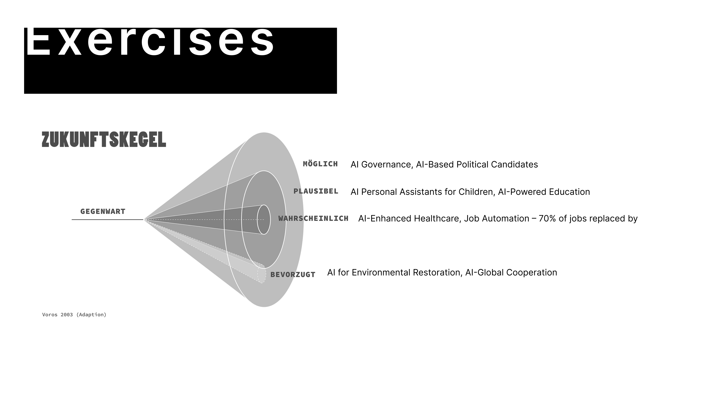

## Brief
Inspired by Qualityland, this web-based game project explores the intersection of AI, fate, and personal agency in a near-future world. I designed a one-page interactive experience, where scroll animations and dynamic visuals, crafted with Anime.js, draw players into the narrative. Built with Vue.js, the game interface serves as both a medium of play and a reflection of our evolving relationship with technology—raising the question: In an era where AI shapes our decisions and defines our futures, do we embrace its guidance or resist its influence?

