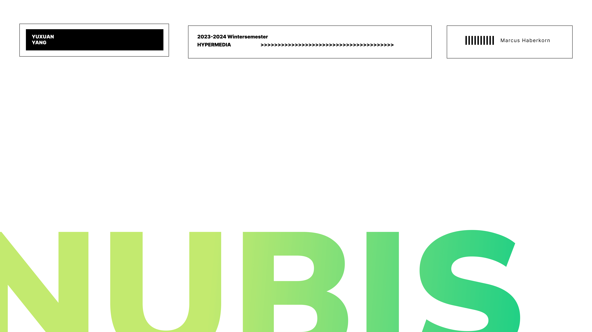
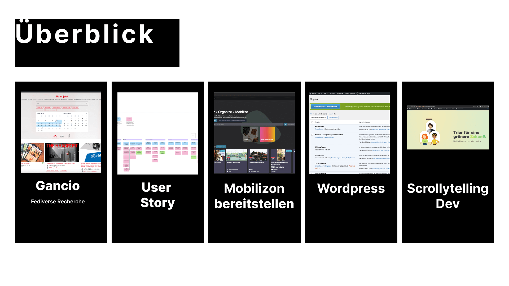
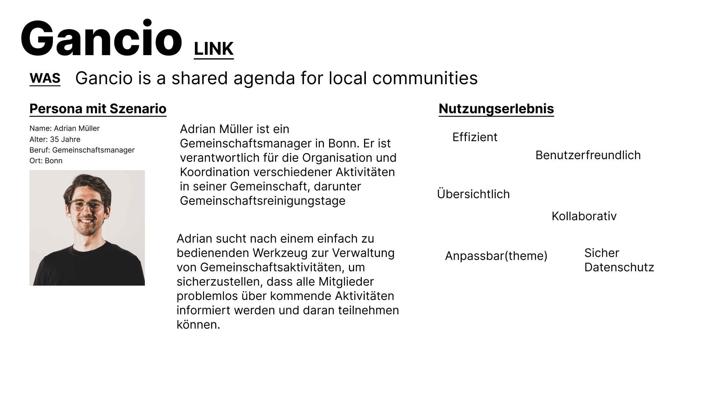
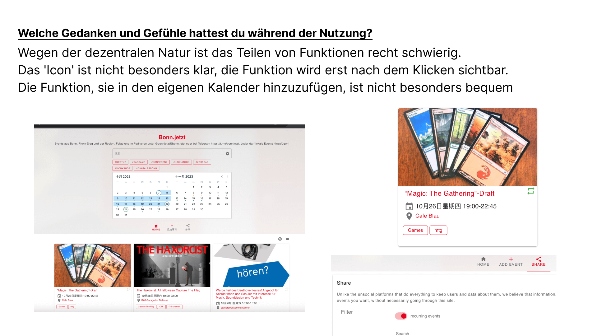
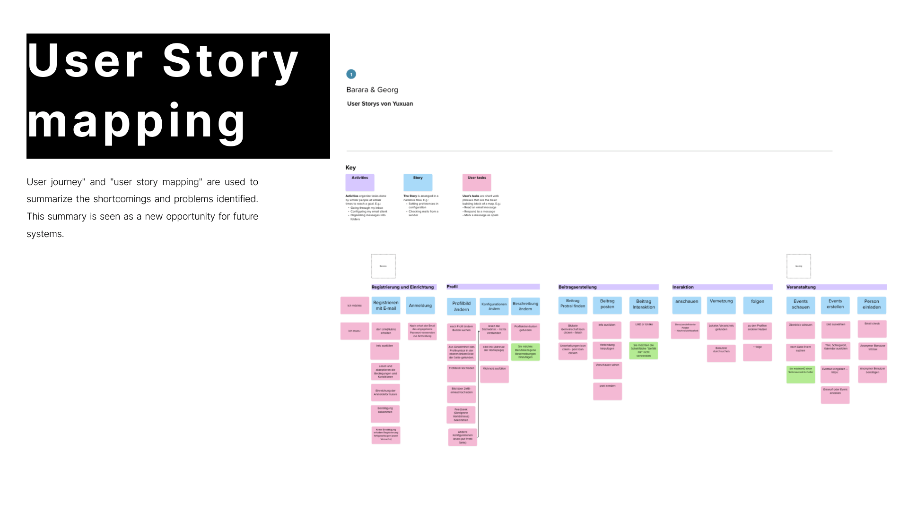
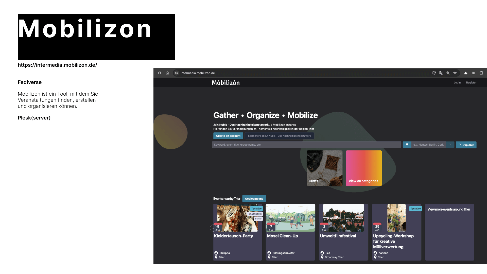
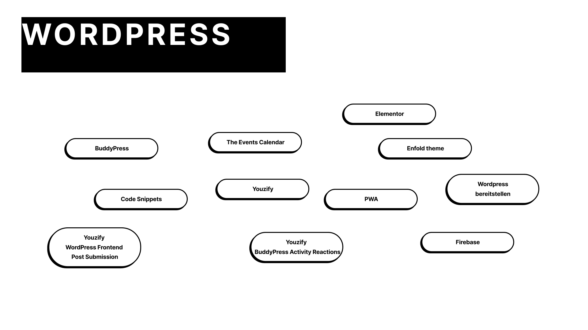
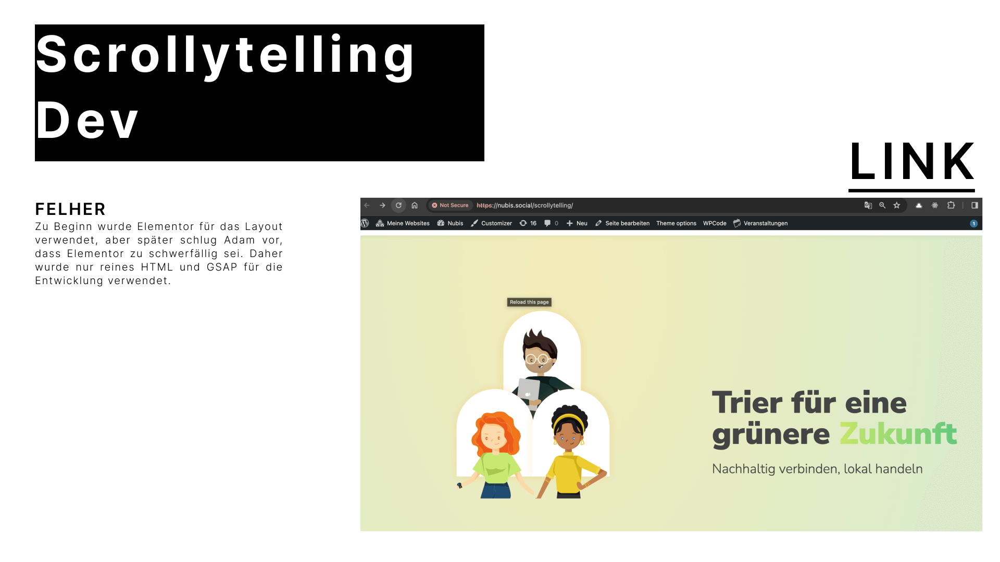

## Brief
In this course, we test the potential of the Fediverse in a real cooperation project with Lokale Agenda 21 Trier e.V. I am responsible for setting up WordPress and developing the scrollytelling website."

## Background
Urban societies are seen as key players in achieving the UN Sustainable Development Goals. In the transformation process, actors are faced with central, location-based questions such as: What can be done (goals, options for action)? How can this be done in concrete terms (techniques, methods, processes)? Who has experience with this (skills)? Who can help (capacities)? How can we achieve more together (coordination, cooperation)?

Nubis is an independent contact point for local sustainability issues that also links existing information services. Nubis primarily creates links between people by offering simple communication channels: Anyone can accept or post offers for action and become active in their immediate environment.

We enable low-threshold self-organization and concrete action, thus increasing self-efficacy and motivation to act.

We use the integrated event calendar platform to create a new level of transparency for all types of events, from further education courses to demonstrations.

All in all, people active in very different areas can reach each other better. In a different way. And open up new opportunities. This creates an active network of all local players and their projects.

## NUBIS LINK
[LINK](http://nubis-trier.de/)

## Online Event link
[LINK](https://intermedia.mobilizon.de/)
