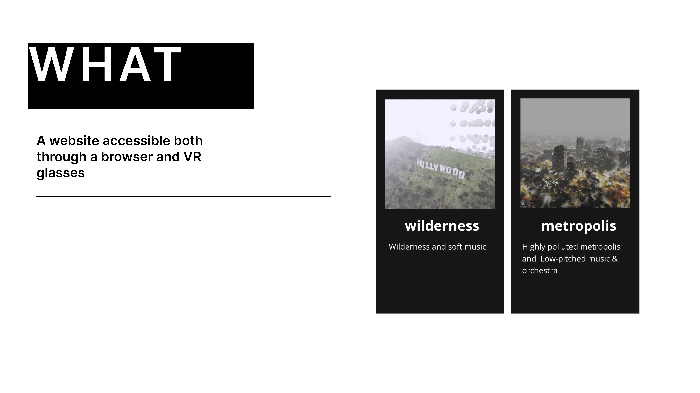
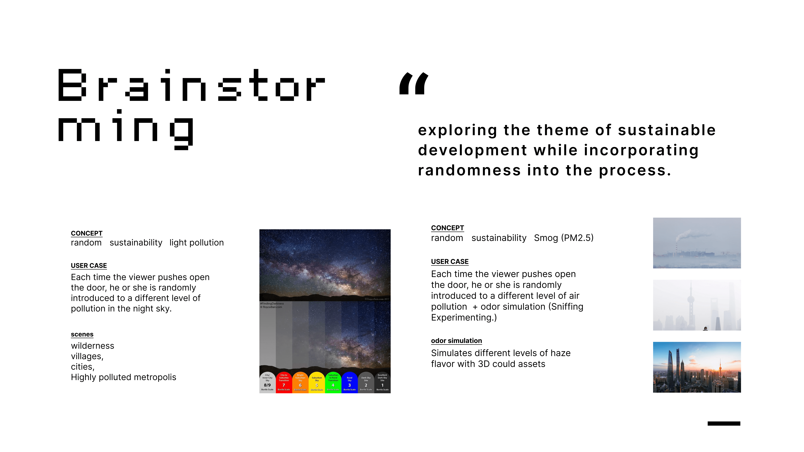
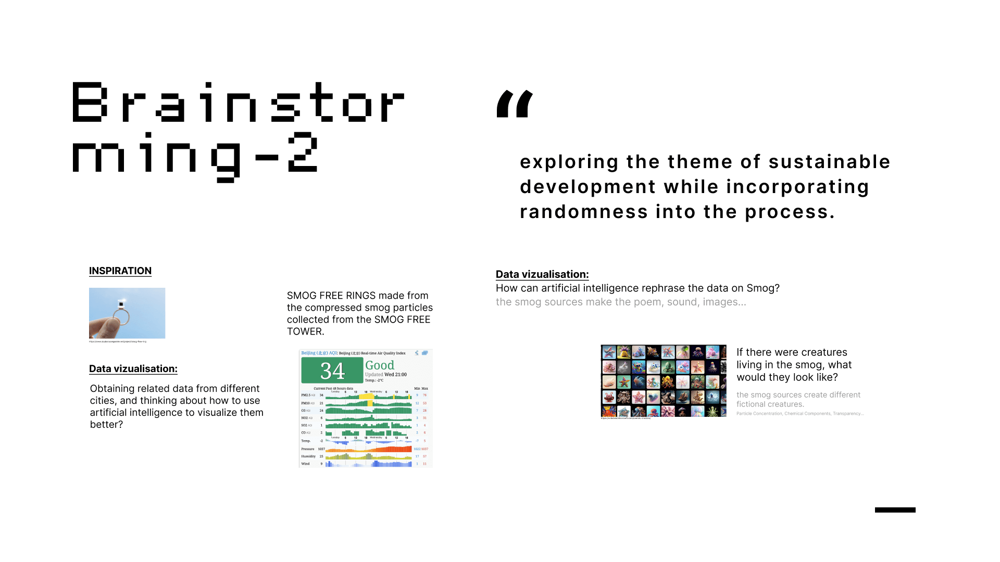
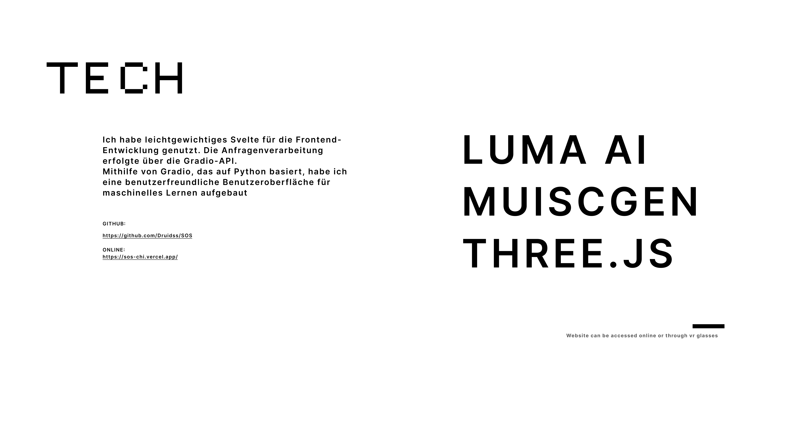
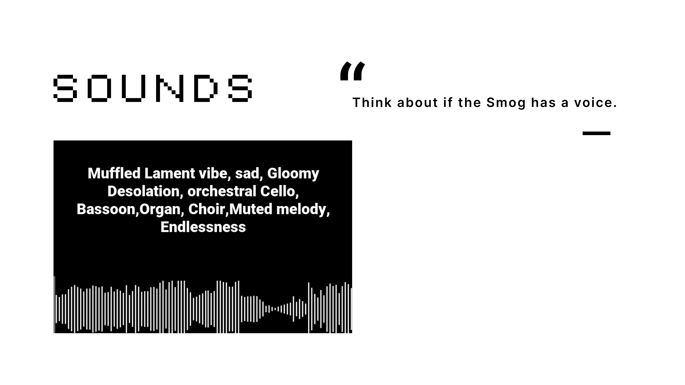

# [LINK](https://sos-chi.vercel.app/)

## WHY?
The reason i create this project is deeply personal – my hometown is Shenyang, a heavily industrialized city. I have experienced the smog that people have to stay at their home, and wear the mask.

## [CODE](https://github.com/Druidss/SOS)

## [LINK](https://sos-chi.vercel.app/)

